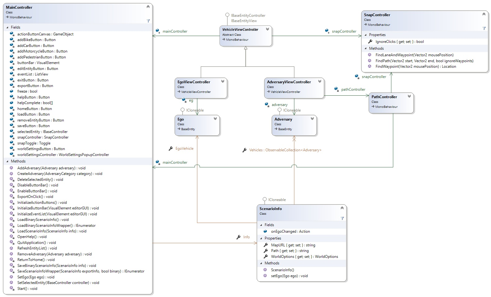
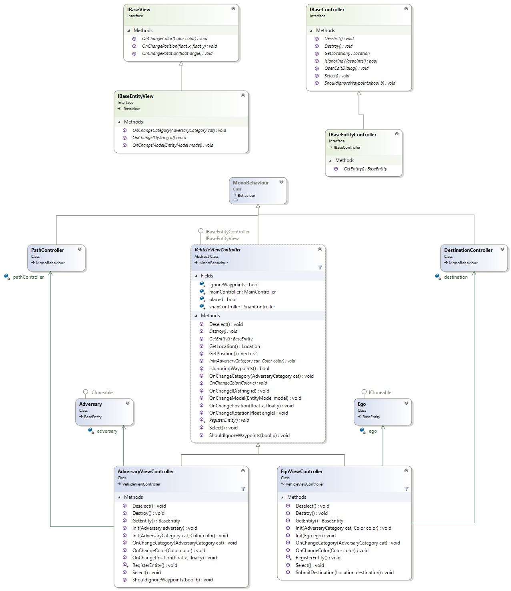
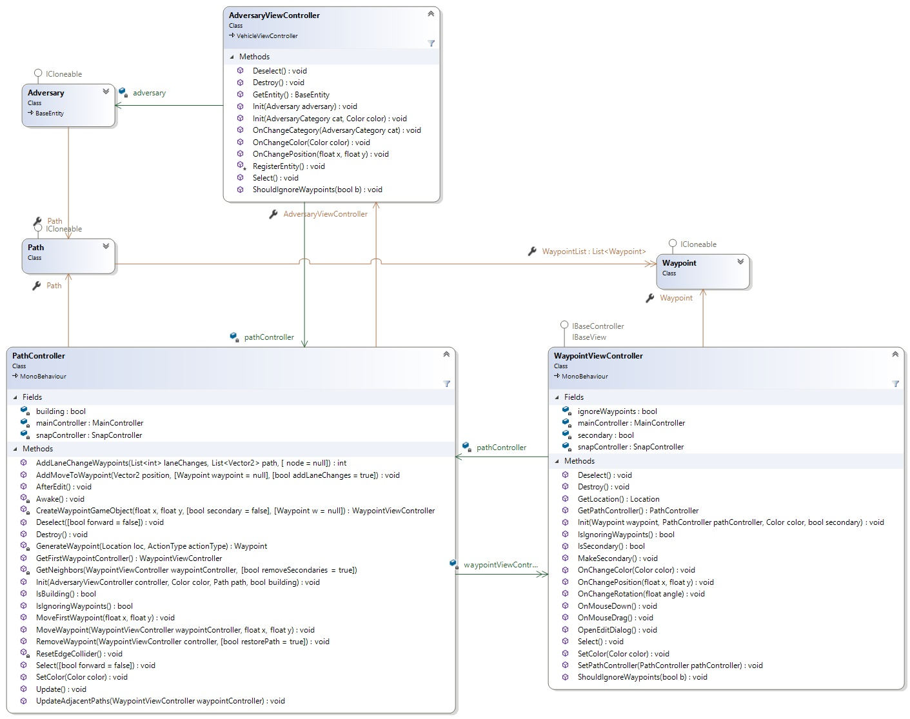

# ScenarioEditor Developer Documentation

## Important Classes

[Maincontroller Diagram](https://github.com/jodi106/AI_Testing_Simulator/blob/main/Developer-Documentation/img/ClassDiagram-MainController.jpg)

*MainController, along with high-level overview of important Controller classes and their relations*

### MainController

The MainController is our central component. It has a reference to a ScenarioInfo object which contains the application's state and acts as the controller for the main GUI elements of our application. As such, it holds references to the buttons which allow the user to spawn entities, remove them, open their settings, open global settings, export the scenario, and much more. Most of the other controllers hold references to the MainController's instance, which they acquire via Unity's Camera.GetComponent function. The MainController is attached to Unity's main camera. Therefore, there will exist only one instance of it over the entire runtime of our application.

It has a field called 'selectedEntity' to a class implementing the IBaseController interface, which contains a reference to the currently selected object. This can either be EgoViewController or AdversaryViewController (which both inherit from VehicleViewController) or a WaypointViewController. The interface allows the MainController to select it, deselect it, destroy it, tell it to open its settings, get its location and to query or set whether the object should ignore Waypoints. The following sections will give a brief introduction to the classes implementing IBaseController.

### VehicleViewController

VehicleViewController is an abstract class that is responsible for displaying the sprite of an entity and responding to the sprite being clicked on or dragged. It does not have a reference to a model-related class. These are added in the two inheriting classes, EgoViewController and AdversaryViewController. Besides the sprite itself, other important fields include 'ignoreWaypoints' which determines whether the entity will snap to Waypoints when it is dragged and 'placed' which is set to false initially and becomes true once the user places a newly created entity. In turn, the RegisterEntity() method is called by an inheriting class and the entity will be added to the ScenarioInfo via the MainController (setEgo or addAdversary). When an entity is clicked, it will apply a different material to the sprite, which will add a highlight effect to it.

### EgoViewController

EgoViewController is the controller of the Ego vehicle, which will be controlled by an AI and therefore does not have a path but only a destination. The controller for the destination (displayed as an X in the application) is called DestinationController. An EgoViewController has exactly one reference to a DestinationController and vice versa. There can only be one Ego vehicle and therefore only one EgoViewController. This is ensured by the MainController which will only instantiate one Ego vehicle.

### AdversaryViewController

The AdversaryViewController class is also implementing IBaseController. Compared to Ego, an adversary does not have a destination but a path. This path is controlled by the PathController class. As with Ego and EgoViewController, there is only one PathController for one AdversaryViewController and vice versa. They also hold references to each other. Once an AdversaryViewController is placed, its PathController is instantiated. The PathController is then responsible for rendering the path of an adversary. To do so, it holds a collection of WaypointViewControllers that control the interaction with the waypoints. A more detailed explanation of the interaction between AdversaryViewController, PathController and WaypointViewController will follow later.

### WaypointViewController

WaypointViewController is the final class implementing IBaseController. Compared to EgoViewController(Ego) and AdversaryViewController(Adversary), a Waypoint is not an Entity and the WaypointViewController does not implement IBaseEntityController but only IBaseController. Therefore, it is missing the getEntity() method. From the perspective of the MainController this distinction is irrelevant as selectedEntity is defined as IBaseController. The reason why WaypointViewController does not implement IBaseEntityController is that an IBaseEntity has fields such as category, model, initialSpeed and color which a Waypoint does not have.

Similar to the other two classes, the WaypointViewController is responsible for handling the clicking and dragging of a Waypoint. It communicates with the PathController to adjust the path.

### SnapController

The SnapController is responsible for rendering waypoint indicators. These are the white dots that the user sees on the roads and which allow vehicles to snap to them. The user can not interact with them in any other way. On top of that, the SnapController also offers methods for finding the closest waypoint indicator to the mouse position and finding the Path between two locations. The latter is used extensively in the PathController. In order to find the path, the SnapController uses the A* algorithm.

## MVC Interactions
[Detailled Controller classes](https://github.com/jodi106/AI_Testing_Simulator/blob/main/Developer-Documentation/img/ClassDiagram-Controllers.jpg)

*Expanded views of VehicleViewController, AdversaryViewController and EgoViewController*

Our application builds on top of the MVC pattern to handle the interaction between state, view, and user controls. Our controllers have references to their model counterparts, which in turn have references to the controllers through their view interfaces. We opted to make our Controller classes act both as controllers and views. Therefore, we called them ViewControllers. They are responsible both for handling interactions with their Unity GameObjects (click, drag, etc.) and reacting to changes in the model with the callbacks defined in the View interfaces. When a user interacts with a GameObject, the controller registers this and updates the model accordingly. The model then calls the corresponding callback, which leads the controller to update the GameObject. With this model, we are not limited to changing the state of a model object through the controller. For example, we could alter the state of a model object in the MainController and the changes would still be automatically reflected in the GameObject (what the user sees). MainController has access to the models through its ScenarioInfo instance.

We follow the same concept for all Controllers except PathController. The Path class has no View for callbacks and the PathController therefore must always keep the visual path in sync with the model.

### An Example

An AdversaryViewController has a reference to an Adversary, which it either creates itself or is passed to it during construction. It also implements the IBaseEntityController and IBaseEntityView interfaces. When the user drags the Adversary GameObject associated with a controller, the onMouseDrag method (defined in the parent class VehicleViewController) is called. Under certain circumstances, the position of the Adversary is changed using IBaseEntity's setPosition method. This method will in turn call IBaseView's (superinterface of IBaseEntityView) onChangePosition method. The view is the AdversaryController itself. It will thereafter change the position of the GameObject. The same concept applies to changing the color, rotation, category, model, and ID of any entity.

## Interaction between AdversaryViewController, PathController and WaypointViewController
[AdversaryController, PathController, WaypointViewController interaction](https://github.com/jodi106/AI_Testing_Simulator/blob/main/Developer-Documentation/img/ClassDiagram-PathController.jpg)

The interaction between AdversaryViewController, PathController, WaypointViewController and their corresponding models Adversary, Path and Waypoint is one of the more complex parts of our application. The AdversaryViewController has a PathController, which is responsible for rendering the path of an Adversary. It has references to all WaypointViewController that define the path. 

As with the other controller classes, the PathController is responsible for both rendering the path and handling interactions with it. In retrospect it would have been sensible to split the two responsibilties into two separate classes as this could have reduced the complexity considerably. In order to render a path, the PathController uses a Unity LineRenderer which is very simplistic and only allows changing the entire path by passing a new set of Positions to it. There are no options to remove a single link or to automatically append one to the end of it. Creating a class which wraps a linerenderer and allows for these basic operations would be a simple way of reducing LineRenderer's complexity. 

In order to keep track of which LineRenderer position a WaypointViewController corresponds to, PathController maintains a List of (WaypointViewController, int) tuples where the int is the index of the LineRender path position. When a path operation takes place (inserting, deleting or appending a waypoint) this list, along with the Path model must be updated. Besides the LineRenderer there is also an edgecollider which must be updated after each operation as well.

On top of this, we also have to account for automatic lane changes on the route between two waypoints. These lane changes are returned from the SnapController's FindPath method and must also be added in order to guarantee that the vehicle will follow the path in the Editor when a simulation is run. These must also be added to list of (WaypointViewController, int) tuples, which also increases complexity.

Contrary to most of the other Controllers, a Path model does not have a View for callbacks. When a path operation takes place, the PathController must always edit the Path model and subsequently update the LineRenderer. This has implications for the generation of a Path when loading a scenario. Because the Path model class does not have callbacks, we can not simply update the model and have the changes automatically reflected in the GameObjects. Instead, we must call PathRenderer methods directly. This also increases complexity and refactoring would again lead to a much simpler solution.

Besides the LineRenderer, which is responsible for rendering the actual path of an entity, we also have a LineRenderer that renders a preview of a path that could be placed. This preview is renderer in the PathRenderers Update method.

## Converting between Carla and Unity Coordinates

We exported the PNGs of the Carla Maps at 25 pixels per meter and are rendering them at 100 pixels per Unit. This means 1 unit in Unity corresponds to 4 meters in Carla. To convert from Unity to Carla we have to multiply the coordinates by 4. Additionally, the origin used for the map is different. In Carla the map's origin is near the center of the map. In Unity we are using the top left corner of the Map as the origin. When we exported the maps, we also collected MinX, MinY, MaxX, MaxY values for each map. To convert from Unity to Carla we would have to add (minX + maxX)/2 ((minY + maxY)/2 respectively) to the x and y coordinates. Also, the y Axis is inverted between Carla and Unity. Therefore, the y value has to be inverted as well.

